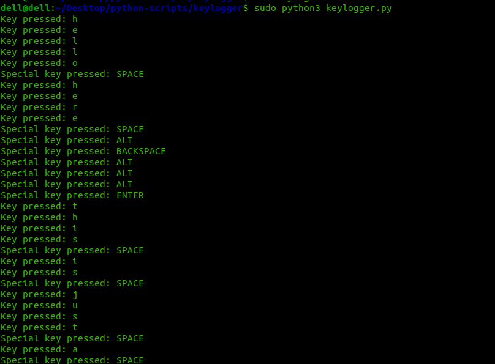

Python keylogger

A keylogger is a type of software designed to monitor and record keystrokes made on a computer or other devices. It captures each key pressed and often logs it to a file for later review. Keyloggers can be used for various purposes, including monitoring user activity for security reasons, debugging, or even malicious intents like stealing sensitive information.

# Testing Example
